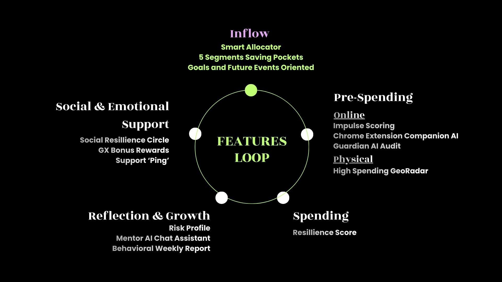
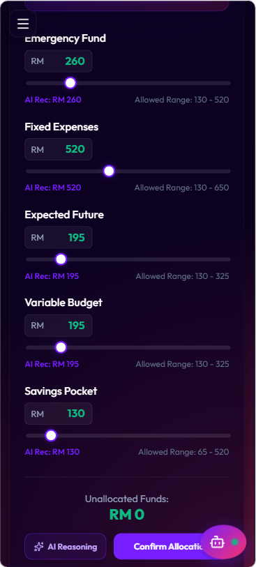
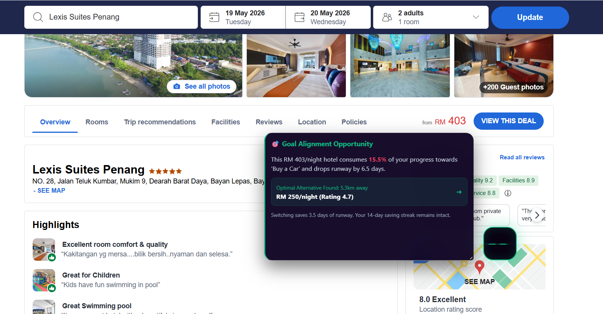
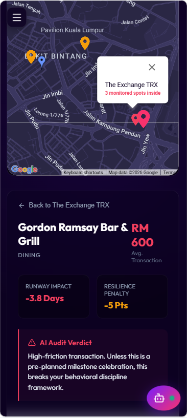
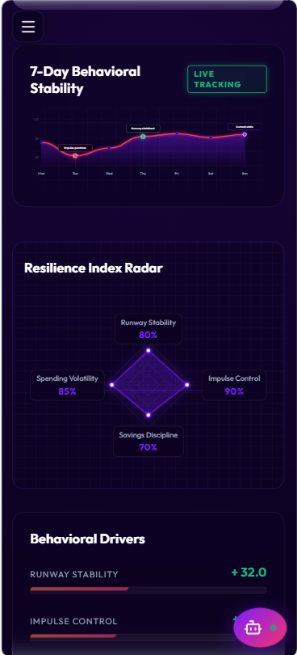
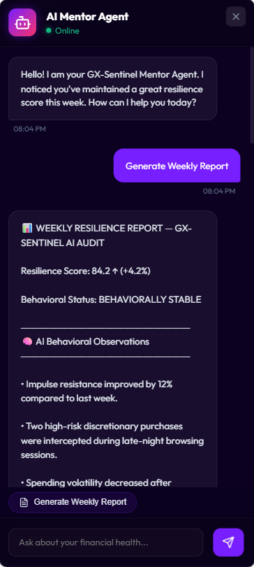
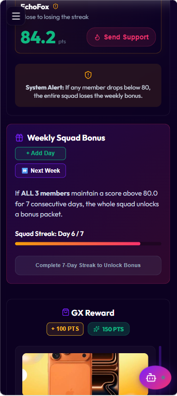

# GX-Sentinel

AI-powered behavioral banking layer for youth financial resilience.

Instead of tracking spending after it happens,
GX-Sentinel intervenes at the exact moment financial decisions are made.

Built for The Youth Resilience Challenge by GXBank.

## 🔗 Links

### 🎬 Pitch Video
[Watch Full Demo Video](https://youtu.be/qucf4fIQc_w)

### 🌐 Frontend Deployment
[Open Web App](https://gx-sentinel.vercel.app/)

### 📂 GitHub Repository
[View Repo](https://github.com/chan050516-sudo/GX-Sentinel)

---

# Product Closed Loop

# Problem

Young Malaysians are financially aware,
but modern digital ecosystems are optimized to remove reflection.

Banking apps record transactions after the damage is done.
GX-Sentinel introduces real-time behavioral intervention before debt accumulates.

# 🧠 Key Features

---

## 1. Smart Allocator

### Income → Automatic Behavioral Protection

Automatically distributes incoming funds into:

* survival budget,
* emergency savings,
* goals,
* and flexible spending.

The system reduces dependence on willpower by turning good financial habits into default automation.

---

## 2. Chrome Extension Companion AI

### Real-Time Online Spending Intervention

The browser extension monitors e-commerce and social commerce environments in real time.

Supported platforms:

* Shopee
* Lazada
* TikTok Shop

The system:

* detects impulse-buying patterns,
* calculates a 5-factor impulse score,
* analyzes contextual risk,
* and introduces behavioral friction before checkout.

Instead of saying:

> “You spent RM850.”

It reframes the purchase into:

> “This removes 6.5 days of financial runway.”

---

## 3. Location Radar

### Offline Spending Awareness

Using Google Maps API and geo-notification systems, GX-Sentinel detects high-spending environments such as:

* malls,
* entertainment districts,
* nightlife zones,
* and premium retail areas.

The system:

* estimates spending risk,
* projects runway impact,
* and suggests nearby lower-cost alternatives.

---

## 4. Resilience Score

### Behavioral Discipline Engine

GX-Sentinel introduces a dynamic behavioral metric called the **Resilience Score**.

The score reflects:

* consistency,
* spending discipline,
* saving streaks,
* and recovery behavior.

This transforms financial resilience into:

* visible progress,
* measurable achievement,
* and positive reinforcement.

---

## 5. AI Mentor & Weekly Reflection

### Post-Action Financial Guidance

Instead of only showing transaction histories, GX-Sentinel helps users:

* review behavioral patterns,
* understand spending triggers,
* simulate runway loss,
* and receive AI-generated financial coaching.

Features include:

* personalized weekly reports,
* risk profiling,
* financial runway analysis,
* and AI mentor conversations.

---

## 6. Social Circle & Bonus Packet

### Community Accountability Layer

Financial resilience is difficult in isolation.

GX-Sentinel adds:

* squad accountability,
* streak sharing,
* community encouragement,
* and peer-based positive reinforcement.

The goal is to transform financial discipline from:

> “individual suffering”
> into
> “socially supported behavior.”

---

# Architecture

Frontend:
- React + TypeScript
- Chrome Extension

Backend:
- FastAPI
- LangGraph multi-agent orchestration

AI:
- Gemini API
- DeBERTa zero-shot classification

Database:
- Firebase Firestore

External APIs:
- Google Maps API

# Business Value

For GXBank:
- Higher CASA retention
- Daily engagement instead of monthly banking usage
- Behavioral insights for personalization

For GX-Sentinel:
- Performance-based revenue sharing
- Analytics dashboard
- API licensing

# 👨‍💻 Team Vision

We believe financial resilience should not depend entirely on self-control.

In a world optimized to maximize impulse,
young people need systems designed to protect reflection.

GX-Sentinel explores what banking could become when AI is used not only to optimize profit —
but to strengthen human decision-making.